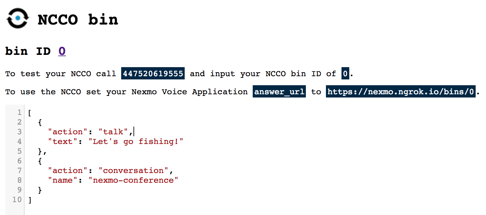

# NCCO bin

A place to create, store and share Nexmo NCCO JSON instructions.

**Status: Work in Progress**



## Running locally

Before you begin you will need:

* ngrok or another local tunnel solution
* A [Nexmo account](https://dashboard.nexmo.com/signup) that has had at least one top up and has some credit

Clone and install dependencies:

```bash
git clone git@github.com:nexmo-community/ncco-bin.git
cd ncco-bin
npm install
```

Create a local tunnel to your web server. This assumes the application is going to run on port 5000.

```bash
ngrok http 5000
```

The above command will provide you with your public URL. This should be used in the next step.

Create a Nexmo Voice Application for your NCCO bin replacing `NGROK_SUBDOMAIN` with the ngrok subdomain from the previous step.

```bash
nexmo app:create 'ncco-bin' https://NGROK_SUBDOMAIN.ngrok.io/answer https://NGROK_SUBDOMAIN.ngrok.io/events --type=voice --keyfile=private.key
```

The above command will save a private key to `private.key` in the current directory. It will also output a UUID for your application. The Application ID should be used in the a later step.

Buy a number to associate it with your NCCO bin Nexmo Voice application. Update the `US` in the command to another country code as required. This will charge your account.

```bash
nexmo number:buy -c US --confirm.
```

The previous step will provide you with a phone number. Use this in the next step.

Link a phone number to your Nexmo Voice application:

```bash
nexmo link:app PHONE_NUMBER APPLICATION_ID
```

The previous step informs Nexmo that any event related to the `PHONE_NUMBER` should be associated with the application with ID `APPLICATION_ID`.

Set up environmental variables:

```bash
cp .env-example .env
```

Update the values in the `.env` file with the `APPLICATION_ID`, `PHONE_NUMBER` and `https://NGROK_SUBDOMAIN.ngrok.io` values.

Run the local NCCO bin instance.

```bash
npm start
```

## License

This application is under [MIT](LICENSE).
